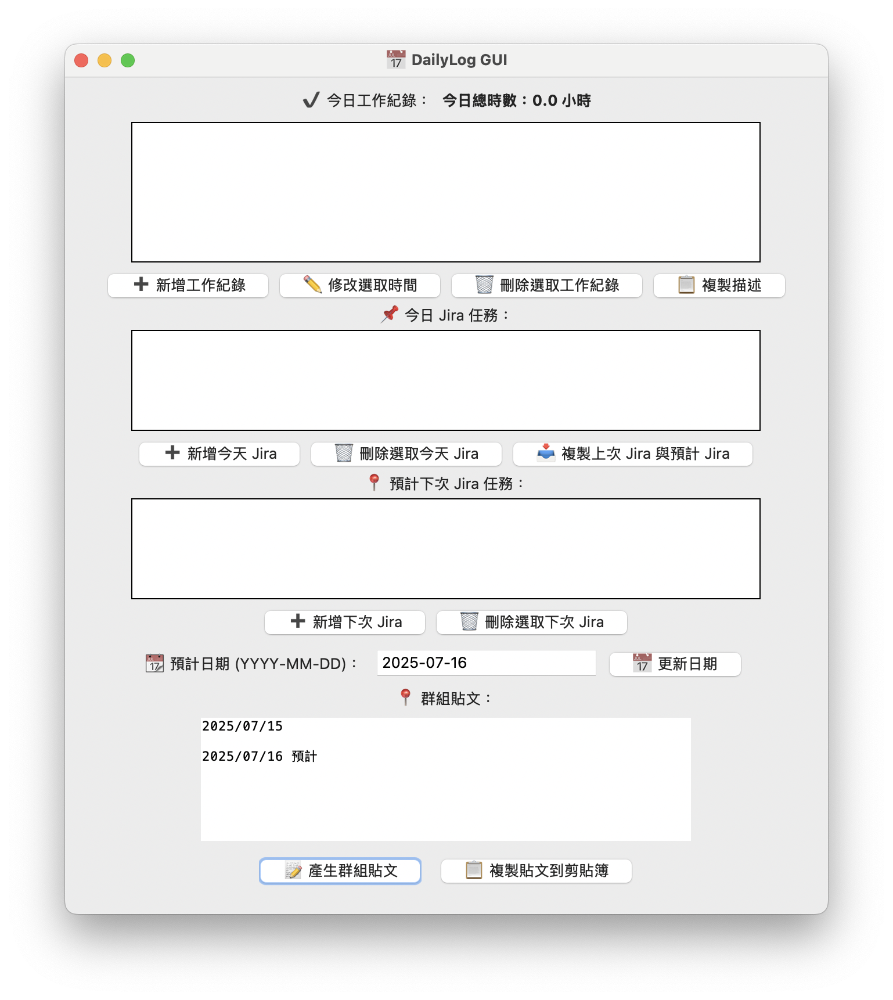

# 🗓️ dailylog-gui

`dailylog-gui` 是一款以 Python tkinter 製作的本地 GUI 工具，方便記錄每日工作事項、追蹤 Jira 任務與自動產生群組貼文內容。

---

## ✨ 特色功能

- ✅ 快速記錄每日工作時段與描述
- 🕘 自動計算今日總工時
- 🧩 支援 Jira 任務紀錄與預計任務規劃
- 📝 一鍵產生群組貼文格式
- 📋 支援複製描述、貼文與前一天任務
- 🔒 本地儲存 `.json`，無需帳號與雲端

---

## 🖼️ 使用畫面

